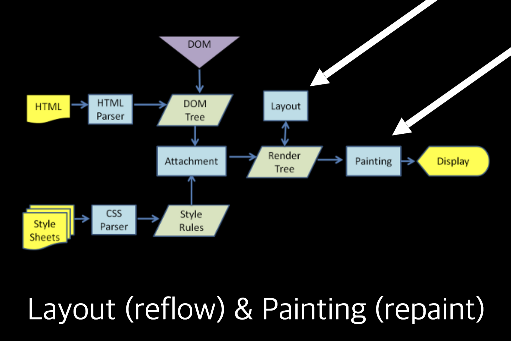

# REACT의 VirtualDOM 

데이터가 들어올 때  DOM 객체들을 관리를 안해주면, 성능이 저하되는데
페이스북 리엑트의 해결법은 DOM들을 새로 파고 만드는것이었다.

하지만 이렇게 모든 웹페이지의 DOM들을 새로만드는것이 이상적일까?

DOM객체를 새로 파고 만드는것은 성능저하의 원인이 된다.

이런 성능저하의 문제를 해결하기위해 virtualDOM을 만들었고, 

virtualDOM은 DOM객체를 새로생성하는 개념이아니다.

# 그 전에 DOM이란? 

> Document Object Modeal 

DOM 자체는 동적이다. 

## DOM의 문제점:

unlimit 스크롤 페이지에서 기존 DOM 객체를 받아오면서 새로 생성하게되는데 
레이아웃엔진에 부하를 줄 수 있다. 브라우저 엔진은 돔 객체에 대해서 
repaint와 reflow 가 발생하게 될때에 연산을 하게 된다.

> - reflow : 위치, 사이즈가 변경될때 전체 페이지를 수정하는 경우
> - repaint : 객체를 다시그린다.

하지만 최근의 브라우저엔진은 최적화에 대한 노력이 엄청나게 들어가있는데
repaint와 reflow에 대한 최적화가 잘 되어있다.

> 참고문서: 
> https://gist.github.com/paulirish/5d52fb081b3570c81e3a

즉 repaint와 reflow가 발생하는 순간에 바로바로 처리가 됬었다면

최근에는 js 코드


- 노드의 스타일을 처리하는 과정 : attachment
- render 트리가 만들어 지는 과정은 attachment가 발생한 이후.
- render가 발생할경우 reflow와 repaint가 발생하게 된다.

1. 돔 트리 만들고
2. 스타일 만들고
3. 돔에 스타일이 붙어지면 render tree 가 시작되어 reflow와 repainting이 발생하게 된다.


# virtualDOM 
DOM 보다는 나아요. 
브라우저내에서 발생되는 연산의 량이 줄게 만들어줘요

# 더블버퍼링
예전 윈도우 프로그래밍에서는 더블 버퍼링이란 방식으로 

보여줄 그림을 메모리에다가 먼저 그린후에, 완성된 화면을 바로 기존 화면에다가 대체해준다.

virtualDOM이 더블버퍼링 개념에서 좀더 확장된 개념이다.
virtualDOM 은 이전과 이후를 비교해서 어떤 virtualDOM에 변화가 있었는지 파악하고 
해당 DOM 만 변경될 수 있도록 해준다. 


# 비교 알고리즘
virtualDOM과 기존 DOM 을 조화롭게 사용할 수 있도록 해준다.

virtualDOM 은 빅오 n 으로 엘리먼트를 찾을 수 있지만
기존 DOM은 빅오 n^3으로 엘리먼트를 찾을 수 있다.

### virtual DOM의 비교알고리즘
1. 형태가 다르면 내부검색을 하지 않겠다
2. 목록을 보여줄 때, 엘리먼트에 키 값을 설정하면서 바뀐것만 변화를 주는 작업에 들어가는데...


응 

잘 찾는다. 그리고 그 찾은 dom 객체에 대해서만 작업을 한다.





### render 방식

``` html
<!-- renderA: -->
  <div>
    <span>Hello!</span>
  </div>
<!-- renderB: -->
  <div>
    <span>Hello!</span>
    <span>World!</span>
  </div>
```

- <span>World!</span> 삽입일 때에는 
- <span>Hello!</span> 의내용을 World 로 변경
- 그 뒤에 <span>Hello!</span> 삽입

# lifecycle

중요해~ 

# webpack의 번들은?

module a, b, c, d, e 와 의존이 있는 파일들에 대해 


webpack은 클라이언트 사이드에서도 모듈들을 require해서 불러올 수 있게 해 주며
서버사이드에서도 모듈들을 require해서 불러 올 수 있다 

# 조심해야 할 것

- JSX는 javascript의 문법이지 실제 지금까지 써왔던 DOM Object가 아니다.
일반 dom 객체의 동작을 상상하며 코드를 계속 짜다가 피똥싸는 날이 다가올것이다.


# react의 style 문자열 셋팅

**옛날**

``` html
<div stlye="
  background-color:black;
  width:500px;
  height:400px;
  ">
  귀요밍
</div>
```


**요즘** 
``` jsx

const asd = {
  
}
```


# 비구조 할당

# 스프레드 연산자(전개 연산자)
object에서도 사용되고 array에서도 사용된다.

# virtualDOM 컨트롤시 주의해야할 것

#### e.stopPropagation() 

DOM객체끼리 범위가 겹쳐있어서 이벤트가 중첩적으로 발생하게 되는 경우.

리스트 안에 있는 수정 및 삭제 버튼을 누르고 싶은데 
삭제나 수정 버튼을 누를 때, 리스트를 선택하지 않게 하려면
삭제나 수정버튼안에 e.stopPropagation()을 집어넣으면된다.

#### e.preventDefault()


