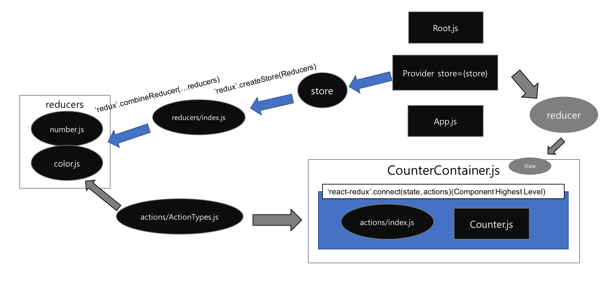

# React
https://velopert.com/3365

# 디렉토리 구조
src/actions: 액션타입, 액션생성자 파일이 저장됩니
src/components: 뷰만을 담당하는 presentational 컴포넌트들이 저장됩니다.
src/containers: store 에 접근이 닿는 container 컴포넌트들이 저장됩니다
src/reducers: 스토어의 기본상태와, 상태의 업데이트를 담당하는 리듀서 파일들이 저장됩니다
src/utils: 일부 컴포넌트들에서 공용되는 파일이 저장됩니다.

# 소스코드 파일 구조

# Container Components & Presentational Components
 Smart Component,  Dumb Component 로 알려져있다.

1. **프리젠테이셔널 컴포넌트**

프리젠테이셔널 컴포넌트는 오직 뷰만을 담당하는 컴포넌트입니다. 
이 안에는 DOM 엘리먼트, 그리고 스타일을 갖고 있으며, 프리젠테이셔널 컴포넌트나 컨테이너 컴포넌트를 가지고 있을 수도 있습니다.
하지만, 리덕스의 스토어에는 직접적인 접근 권한이 없으며 오직 props 로만 데이터를 가져올수 있습니다. 
또한, 대부분의 경우 state 를 갖고있지 않으며, **갖고있을 경우엔 데이터에 관련된것이 아니라 UI 에 관련된것이어야 합니다.**

주로 **함수형 컴포넌트**로 작성되며, **state 를 갖고있어야하거나, 최적화를 위해 LifeCycle 이 필요해질때** 클래스형 컴포넌트로 작성됩니다.

2. **컨테이너 컴포넌트**

이 컴포넌트는 프리젠테이셔널 컴포넌트들과 컨테이너 컴포넌트들을 관리하는것을 담당합니다.
주로 내부에 DOM 엘리먼트가 직접적으로 사용되는 경우는 없습니다.
사용되는 경우는 감싸는 용도일때만 사용 됩니다.
또한, 스타일을 가지고있지 않아야합니다.
스타일들은 모두 프리젠테이셔널 컴포넌트에서 정의되어야 합니다.
상태를 가지고 있을 때가 많으며,
리덕스에 직접적으로 접근 할 수 있습니다.

## 컨테이너 가이드라인

어떤 것을 컨테이너 컴포넌트로 만들어야 하나?
주로 : 페이지, 리스트, 헤더, 사이드바, 내부의 컴포넌트 때문에 props가 여러 컴포넌트를 거쳐야 하는 경우

컨테이너 컴포넌트라고해서 무조건 그 내부에 여러개의 컴포넌트가 있어야하는것이 아닙니다. 

예를들어 Item 이란 프리젠테이셔널 컴포넌트가 있다면, ItemContainer 라는 컴포넌트를 만들어서 그 안에 Item 컴포넌트 하나만 넣고 데이터를 연결해주는 것도 가능합니다.

추가적으로, 어떤걸 컨테이너로 만들지, 그리고 이 구조를 사용할지는 여러분의 자유입니다. 

이 구조는 리덕스의 창시자 Dan Abramov가 공유한 구조이긴 하나, 무조건 따라야 할 규칙이 아닙니다
[[1]](https://twitter.com/dan_abramov/status/802569801906475008). 
따라하면 유용한 팁일수도 있고, 어쩌면 여러분들의 개발 흐름에 어울리지 않을 수도 있습니다. 
무조건 프리젠테이셔널 컴포넌트로 분리하지 않고 그냥 DOM 엘리먼트를 지닌 컴포넌트에 직접 리덕스를 연결해도 상관없습니다. 

그러다 나중에 컴포넌트를 재사용을 해야될 때쯤 다시 분리시켜도 되구요.

