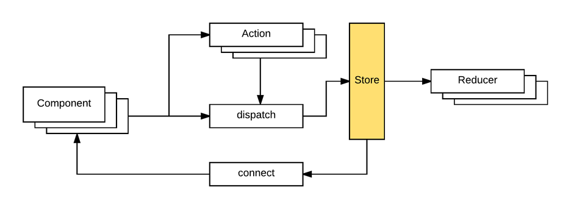
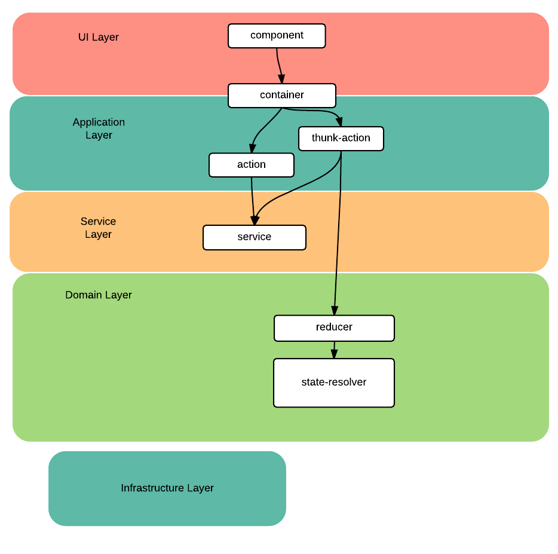
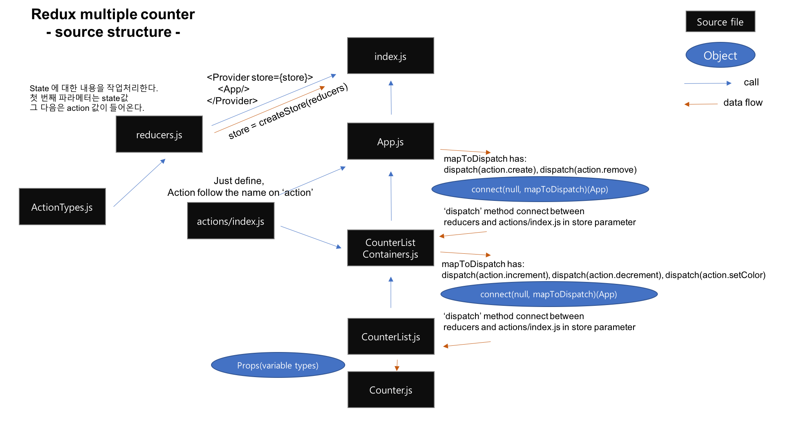

# React
소스코드 : https://velopert.com/3365

글 복사 : http://m.post.naver.com/viewer/postView.nhn?volumeNo=4575578&memberNo=1377642#

*이 깃의 저작권은 위 링크의 주인들에게 있습니다.*

# Redux의 특징
 - 단일 스토어, 다수의 리듀서 정책
 - 상태처리에 대한 책임을 스토어의 하위에 있는 리듀서에게 넘기는 '단일 스토어, 다수의 리듀서 전략'
 - 리덕스에서 스토어는 컴포넌트와 리듀서를 연결하는 아주 짧은 레이어일 뿐. 상태와 상태처리는 리듀서가 책임진다.
 - 스토어는 여러개의 리듀서를 가질 수 있다. 각각의 리듀서가 처리할는 상태는 최종적으로 최상위 리듀서가 시스템 상태 트리로 만들어서 스토어를 구족하는 구독자 (Subscriber)에게 전달한다.



각각의 리듀서가 처리하는 상태는 최종적으로 최상위 리듀서가 시스템의 상태 트리로 만들어서 스토어를 구독하는 구독자에게 전달한다. 

# Redux의 설계

1. 처음 설계는 항상 리듀서부터 시작이다.
2. 리듀서로 상태값을 처리할 때에는 리덕스의 공식 문서에 있는 예제들은 순수 함수를 적극 활용한다. 
Dan Abramov가 함수형 프로그래밍에 영감을 받아서 리덕스를 만들었기 때문인 듯하다. 순수 함수는 아래와 같은 특징을 갖는 함수를 말한다.
    
    Dan Abramov
    1. 함수 밖에 있는 데이터나 변수를 변경해서 의도치 않은 결과를 발생시키지 않아야 한다.
    2. 동일한 입력 데이터의 집합을 제공받으면 항상 동일한 연산 결과를 반환해야 한다.

    > 이 지점에서 오해하지 말아야 한 가지는, 리듀서를 '순수'하게 만들기 위해서 반드시 함수를 고집해야 하는 건 아니라는 점이다. 객체를 이용해서도 얼마든지 리듀서를 순수하게 만들 수 있다. 모든 건 구현하기 나름이니  리덕스에 함수형 철학이 묻어있다고 '함수형이 짱짱맨'이라는 생각은 하지 말자. 다만 리덕스를 이용하면 함수 단위로 코드를 작성하는 게 조금 더 자연스러울 뿐이다.

3. 사용자가 수행하는 하나의 동작은 다수의 기능과 결합할 수 있다. 따라서 너무 당연한 이야기지만 액션과 리듀서의 관계는 1:N이다.
4. 리덕스를 접할 때 애플리케이션의 '모든 상태'를 리듀서에서 관리하고, 컴포넌트 자체는 무상태로 만들어야 한다고 생각하는 경우는 오해다. 아니다.
5. 컴포넌트는 지역 상태를, 리듀서는 전역 상태를 관리할 수 있고 그래야  효율적이고 유연한 애플리케이션을 만들 수 있다. 

# 지역 상태와 전역 상태
Local state(Normal State) 와 Global State(Redux state)

1. Presentational Comonent & Dumb Container [ Local State ]
표현 컴포넌는 리덕스 시스템과 별개인 컴포넌트로 화면에 컴포넌트를 어떻게 렌더링 할지를 결정하고, 사용자의 요청을 이벤트로 받아 상위 컴포넌트로 전달하는 역할만을 수행한다.
 - 상위 컴포넌트에서 값을 받아 렌더링을 결정
 - 이벤트 발생시 이벤트를 상위컴포넌트로 전달

2. Container Component & Smart Container [ Global State ]
표현 컴포넌트와 리덕스 시스템 사이의 연결 고리로 하위 컴포넌트에서 올라오는 요청을 해석하여 시스템의 어느 쪽으로 요청을 전달(mapDispatchToProps) 할 것인지를 결정하고, 전체 시스템의 상태 트리를 스토어로부터 넘겨받아 하위 컴포넌트로 전달(mapStateToProps) 하는 책임을 수행한다. 
 - 리듀서에서 넘어온 상태와 이벤트들을 하위컴포넌트로 전달(mapStateToProps)
 - 하위컴포넌트로부터 받은 이벤트를 리듀서로 전달(mapDispatchToProps)


**결론 :** 결국 컨테이너라는 존재에 의해 컨테이너가 아닌 모든 컴포넌트는 리덕스에 얽매이지 않는, 독립적인 개체로서 자율성을 가질 수 있는 셈이다. 이렇게 말 할 수 있는 이유는 
컨테이너 컴포넌트로 부터 값을 하위컴포넌트로 전달하지 않아도 되는 하위컴포넌트들이 존재할 수 있기때문에 자율성을 가질 수 있는 것이다.
즉, 필요한 지점에서 컨테이너를 이용해 컴포넌트를 리덕스 시스템과 결합하면 된다.

**안티패턴 :**
1. 컴포넌트를 드래그 앤 드롭할 때 현재 좌표 값 표현
2. 현재 스크롤 좌표 추적같이 매우 빈번한 연산을 요구하는 인터랙션 처리
최대한 연산 수행 시간을 줄여야 하는 상황에서 상태를 변경할 때마다 아래와 같은 과정을 거쳐야 한다는 건 생각만 해도 아찔한 일이다. 
결국 컴포넌트와 리듀서, 모두에게 각자의 상태를 들고 있어야 할 나름의 사정이 있다.

**간단한 동작 구조**
> "action -> dispatch -> store -> reducer -> store -> compoent"

## Redux에서 말하는 전역상태와 지역상태의 차이

**전역상태 정의 :** "영속성을 가져야 하는 도메인 데이터, 또는 서로 다른 컨테이너나 컴포넌트 간에 공유해야 하는 UI의 상태"
리덕스에서 리듀서는 전역상태의 역할, 정의와 같다. 에디터를 예로 들자면, 

1. 사용자가 작성한 문서에 대한 정보는 도메인 데이터로 영속성을 가져야 한다.
2. 애플리케이션의 생애 주기들을 관리해야 한다
3. 시스템을 종료했다가 다음에 다시 데이터를 불러와서 동일한 상태를 재현할 수 있어야 한다. 
4. 이러한 상태는 신뢰할 수 있는 단일한 장소에서, 일관성을 가지고 관리해야 한다. 

전역상태의 정의에 대한 역할들이지만 리덕스에서의 리듀서는 같은 의미로 정의된다.

**지역상태 정의 :** ""컴포넌트가 시스템과 상관없이 독립성을 갖고 표현 로직을 처리하는 데 필요한, 컴포넌트 내부에 캡슐화할 수 있는 상태"
컴포넌트의 모든 상태를 리듀서에서 관리하면 컴포넌트와 리듀서가 강하게 결합해 종속성이 생긴다. 
또한 매우 빈번한 연산을 수행하는 데 필요한 상태를 리듀서에서 관리하면 상당한 비효율이 발생한다.
이런 상태는 **컴포넌트 내부에 캡슐화하여 컴포넌트가 자율적으로 상태를 처리할 수 있게 두는 게 좋다.**

# 리엑트와 리덕스 결합중에 걱정거리

mapStateToProps를 이용하면 스토어에서 전달받은 상태 트리를 컴포넌트에 전달하기 전에 원하는 형태로 가공할 수 있다. 통역가 역할을 수행하는 셈인데, 이 함수 덕에 컴포넌트와 리듀서, 어느 쪽의 상태 구조가 바뀌어도 변경이 미치는 파급을 최소화할 수 있다.

``` js
import { createSelector } from 'reselect'
import { connect } from 'react-redux'
import { setVisibilityFilter } from '../actions'
import Link from '../components/Link'

const mapStateToProps = (state, ownProps) => {
  return {
    active: ownProps.filter === state.visibilityFilter
  }
}

const mapDispatchToProps = (dispatch, ownProps) => {
  return {
    onClick: () = {
      dispatch(setVisibilityFilter(ownProps.filter))
    }
  }
}

const FilterLink = connect(
  mapStateToProps,
  mapDispatchToProps
)(Link)

export default FilterLink 
```

리덕스처럼 이벤트 통지를 직접 사용자가 제어하지 않는 단일 스토어 방식은 컴포넌트가 구독할 스토어의 이벤트를 직접 지정할 수 없다는 단점을 가지고 있다. 이로 인해 컴포넌트는 자신의 활동과 상관없는 이벤트를 구독해야 한다. 결국 **하위 컴포넌트에 불필요한 조정(reconcilation) 프로세스를 발생시켜 이 결과로 애플리케이션의 성능을 저하시킬 가능성이 높아진다.**

이 점이 마음에 걸린다면 reseletor 같은 모듈을 이용하면 좋다. 이전 상태를 캐시하고 있다가 새로운 상태가 들어오면 변경 여부를 확인하여 변경이 있을 때만 하위 컴포넌트로 상태를 전파하는 문지기 역할을 하는 모듈이다. 리듀서의 상태를 불변(Immutable)하게 관리하면 이 지점에서 성능상 이점을 얻을 수 있다.


``` js
const getVisibilityFilter = (state, props) =>
  state.todoLists[props.listId].visibilityFilter

const getTodos = (state, props) =>
  state.todoLists[props.listId].todos

const makeGetVisibleTodos = () => {
  return createSelector(
    [ getVisibilityFilter, getTodos ],
    (visibilityFilter, todos) => {
      switch (visibilityFilter) {
        case 'SHOW_COMPLETED':
          return todos.filter(todo => todo.completed)
        case 'SHOW_ACTIVE':
          return todos.filter(todo => !todo.completed)
        default:
          return todos
      }
    }
  )
}

const makeMapStateToProps = () => {
  const getVisibleTodos = makeGetVisibleTodos()
  const mapStateToProps = (state, props) => {
    return {
      todos: getVisibleTodos(state, props)
    }
  }
  return mapStateToProps


const mapDispatchToProps = (dispatch, ownProps) => { 
  return { 
    onClickDisplay: () => {  // 1번
      dispatch(setVisibilityFilter(ownProps.filter)); 
    }, 
    onClickTodo: (id) => {  // 2번
      dispatch(toggleTodo(id));
    } 
  } 
} 
```

mapStateToProps가 스토어에서 리액트 컴포넌트로 들어가는 통로라면, mapDispatchToProps는 반대로 리액트 컴포넌트에서 스토어로 들어가는 통로다. mapDispatchToProps는 리액트 컴포넌트에서 발생한 이벤트를 액션과 결합하여 스토어로 전달한다. 스토어로 전달한 액션은 리듀서로 넘어가 전역 상태를 변경한다.

리덕스는 mapDispatchToProps가 반환하는 객체를 하위 컴포넌트에 props로 전달한다. 결국 이는 애플리케이션의 요구 사항을 하위 컴포넌트에 콜백으로 전달하는 셈이다. 구글에서 예제를 찾아봤더니 리액트와 리덕스를 결합하는 방식을 크게 두 가지로 압축할 수 있었다.

1. 이벤트(onClick, onChange, onUpdate...) 기반으로 결합
2. 요구 사항을 수행하는 메서드(toggleTodo, updateVideo...)를 전달하여 결합

1번은 컨테이너에서 react 컴포넌트로 이벤트 콜백 함수를 내려주면,
컴포넌트는 내부에서 발생하는 사건을 이벤트로 컨테이너에게 알려준다.
컨테이너가 발생한 이벤트를 해석하여 수행할 동작을 결정하는 방식이다.

2번은 컨테이너에서 dispatch와 액션을 결합한 행위를 조합하여 props로 내려주면, 리액트 컴포넌트가 어떤 행위를 어떤 시점에 실행할지 알아서 결정하는 방식이다.

# 이름짓기를 조금 주의하자.

``` js

1번 코드
const mapDispatchToProps = (dispatch, ownProps) => { 
  return { 
    onClickDisplay: () => {  // 1번
      dispatch(setVisibilityFilter(ownProps.filter)); 
    }, 
    onClickTodo: (id) => {  // 2번
      dispatch(toggleTodo(id));
    } 
  } 
} 

2번 코드
const mapDispatchToProps = (dispatch, ownProps) => { 
  return { 
    setVisibilityFilter: () => {  // 할 일을 클릭하면 필터를 변경(setVisibilityFilter)
        dispatch(setVisibilityFilter(ownProps.filter)); 
    }, 
    toggleTodo: () => { // 할 일을 토글(toggleTodo) 
        dispatch(toggleTodo(id)); 
    } 
} 
```
요구사항이 바뀌어서 할 일을 클릭하면 필터를 변경(setVisibilityFilter)하고 할 일을 토글(toggleTodo) 해야 한다고 가정해보자.

**1번 코드는,**  

첫 번째 방식의 경우, 아래와 같이 코드를 수정하면 하위 컴포넌트에서는 특별히 다른 처리를 할 필요가 없다. 이벤트 기반으로 props를 구성해서 하위 컴포넌트와 컨테이너를 결합했기 때문에, 컨테이너가 UI에서 발생한 이벤트를 해석하여 적당한 대상에게 전달하는 책임을 지는 것이 자연스럽다.

**2번 코드는**  

무슨 말장난인가 싶다. 단순하게 함수 이름 짓는 방식의 차이 정도로 보이기 때문이다. 맞다. 지금 정도의 코드라면 큰 문제가 없고 이 둘 간의 차이는 무시할만하다. 문제는 요구사항 변경이 일어났을 때다.
요구사항이 바뀌어서 할 일을 클릭하면 필터를 변경(setVisibilityFilter)하고 할 일을 토글(toggleTodo) 해야 한다고 가정해보자. 첫 번째 방식의 경우, 아래와 같이 코드를 수정하면 하위 컴포넌트에서는 특별히 다른 처리를 할 필요가 없다. 이벤트 기반으로 props를 구성해서 하위 컴포넌트와 컨테이너를 결합했기 때문에, 컨테이너가 UI에서 발생한 이벤트를 해석하여 적당한 대상에게 전달하는 책임을 지는 것이 자연스럽다.

이와는 달리 두 번째 방식은 props가 행위를 의미하는 이름을 가지고 있다 보니, 아래의 코드처럼 컨테이너로부터 props로 전달받은 행위를 하위 컴포넌트 내부에서 조합하는 형태로 처리하는 유혹에 빠지기 쉽다. 이는 곧 사용자 인터랙션으로 발생한 이벤트를 해석하는 책임을 컴포넌트 내부에서 지는 모양새다.

2번 코드대로라면 Presentaion Component는 이런 코드를 갖게 될 것이다.

``` js
const TodoList = ({ todos, setVisibilityFilter, toggleTodo }) => ( 
  <ul> 
    {todos.map(todo =>
      <Todo
        key={todo.id}
        {...todo} 
        onClick={() => 
            setVisibilityFilter(); 
            toggleTodo(); 
        } 
      />
    )}
  </ul> 
) 

```
2번째 방식을 이용하여 코드를 짜면 Presentaional Component의 코드는 이제 컴포넌트가 시스템의 요구 사항과 강한 의존성을 갖게 돼 유연성이 떨어져 버리기 쉽다. 
아직까지 심각한 수준이 아니지만 이런 게 하나둘 쌓이다 보면 걷잡을 수 없다. 
물론 아래처럼 첫 번째 방식과 동일하게 해결할 수도 있으나, 함수나 변수의 이름은 알게 모르게 개발자의 생각에 큰 영향을 미친다. 
참여 구성원이 많은 프로젝트일수록 코드에 작성자의 의도를 잘 담아내는 일이 중요하다.


**결론**

여기에서 이야기하고자 하는 핵심은, 어떤 방법을 사용하든 UI에서 발생하는 인터랙션을 해석하여 어떤 액션과 결합할 것인지를 결정하는 책임은 컨테이너에 맡겨야 한다는 점이다. 그래야 리액트 컴포넌트와 리덕스 시스템의 결합도를 낮출 수 있다.


# 리덕스에 레이어 설계를 더하기

MVC 패턴을 설계를 해본사람은 모델, 뷰, 컨트롤러에 익숙해져 있을 것이다. MVC 패턴의 모델, 뷰, 컨트롤러는 시스템의 전체를 의미하지 않는다.
시스템에 정말 작은 부분이지만 그 부분을 단지 강조하는 것 뿐이다. 이는 리덕스에게도 같은말이다.
Flux 플럭스 아키텍쳐에 기반을 둔 리덕스가 말하는 구성요소들인, 컴포넌트,컨테이너, 엑션,스토어, 리듀서가 아키텍쳐 전부를 설명할 수 없다.
리듀서의 본질을 정리한 문서에서는 [상태 트리 설계 규칙을 세웠으며, 지역상태와 전역상태를 구분하는 규칙]을 만들었지만 여전히 리덕스 안에 담을 수 없는 모호한 부분들이 있다.

*//고민거리*
비동기 1.Ajax 통신을 예로 들어보면, 리듀서에는 순수함수이며, 상태에값에 대한 컨트롤을 담당하기 때문에 Ajax통신이 위치해 있으면 안된디. 
그렇다면 어디에 위치해야하는가? 컨테이너? 컴포넌트? 액션? 미들웨어? 
2.또한, 외부에서 데이터를 가져와 개발중인 시스템이 해석할 수 있는 포맷으로 데이터를 변환하는 전 처리는 어디에서 해야할까? 
3.여러 액션을 하나의 요청단위로 묶어야 한다면 어디에다 만들어야 할까?

**우선 결론은 어디에 ajax통신코드를 두어도 장단점이 있으며 어색하지 않다.**

다만 비슷한 책임을 수행하는 녀석들을 서로 근접한 곳에 일관성 있게 모아둘 규칙이 필요했다.
아래 이미지는 레이어 설계를 정리한 다이어그램이다. 도메인 주도 설계를 참고하였으며 지침으로 받아들여진 문서이다. 



레이어를 합의하고, 컨테이너, 액션, 리듀서의 역할을 정리했다. 이제 새로운 책임이 등장하면 앞에서 정한 규칙에 맞춰 소속을 결정한다. 다만, 그 조차도 모호할 때가 종종 있다는 건 함정이지만, 큰 틀은 마련한 셈이다.

**UI 레이어** component, container

UI 레이어는 사용자에게 정보를 보여준다. 지역 상태와 관련한 사용자의 요청을 해석하여 상위 컴포넌트 혹은 컨테이너로 전달한다. 컨테이너는 UI를 리덕스 시스템과 연결하는 연결 고리 역할을 한다.

**애플리케이션 레이어** container, thunk-action, action

애플리케이션의 활동을 조율하는 얇은 레이어 UI 레이어에서 넘어온 사용자 요청을 해석하여 적절한 레이어로 전달한다. 어떤 상태도 직접 보관하거나 관리하지 않는다. 시스템에 사이드 이펙트를 만드는 외부와의 커뮤니케이션 요청을 처리하는 로직은 애플리케이션 레이어에 위임한다. 사용자의 요청을 해석하는 로직이 복잡하거나, 외부에서 넘겨받은 데이터를 가공해야 하는 등의 복잡한 연산을 수행해야 한다면, 관련 로직을 캡슐화하여 서비스 레이어에 위임할 수 있다.

**서비스 레이어** service

XHR을 이용한 외부 데이터 요청, 외부 데이터 변환 같은 애플리케이션 레이어의 임무 수행을 지원하는 모듈이 위치한다. 리듀서에서 사이드 이펙트를 불러오는 외부 데이터 요청을 금지하는 리덕스의 특성상, 외부의 리소스를 요청하는 처리를 이 레이어에서 담당한다.

**도메인 레이어** reducer

도메인 정보를 가지고 있으며, 생성, 변경, 삭제 등을 담당한다. 전역 상태를 관리하고 처리하며, 처리한 결과를 통지한다. 업무 규칙을 관리하며 전역 상태를 처리할 때 적절한 업무 규칙을 적용한다. 리덕스의 특성상 영속성과 관련한 책임은 도메인 레이어에서 수행하지 않는다.

**인프라스트럭쳐 레이어** state-resolver

다른 레이어 모두를 지원하는 라이브러리로 동작한다. 레이어 간의 통신을 제공하고 전역 상태의 영속성을 책임진다. 사용자 인터페이스 레이어에서 사용하는 내/외부 라이브러리를 포함한다.


# 리듀서와 액선, 그리고 단위 테스트 디자인

리덕스에서 단위테스트는 어떻게 진행할까?
리덕스에서 단위테스트를 진행하여 테스트 해볼 수 있는것은 아마도 state의 상태값이 잘 유지가 되고 있는지, 그리고 ajax통신이 잘 이루어지고 있는지 정도가 있다.
그래서 리듀서와 액션의 테스트를 따로 진행을하였다. 하지만 작성하다 보니 뭔가 비효율적이라는 생각을 지울 수가 없었는데 그때 고민했던 포인트는 다음과 같다.

1. 액션의 행위는 너무 단순하여 테스트로 얻을 수 있는 이점이 매우 적다(특히 순수한 액션)

2. 액션은 결국 리듀서와 결합해야 하고, 액션이 반환하는 값 자체보다 리듀서가 액션이 전달한 요청을 제대로 처리하고 있는지가 더 중요하다.

3. 리듀서의 행위를 테스트하려면 어쨌든 액션 만드는 페이로드가 필요하다. 더미로 만들 수 있지만 이 경우 실제 액션이 생성하는 페이로드와 더미 페이로드 간의 동기화 문제가 생겨 테스트를 취약(fragile) 하게 만든다.


위 고민 포인트는 아래와 같이 해결해 본다면 .. 

``` js
//리듀서와 액션의 테스트를 하나로 통합했다. 리듀서를 테스트하면 액션은 자연스레 검증된다
it("컴포넌트 목록에서 원하는 컴포넌트 하나를 삭제할 수 있다.", ()=>{
  
  // given
  const deleteTarget = 'target'
  const action = compListAction.deleteComponent(deleteTarget)

  // when
  const { oreder, compMap } = compListReducer(initState, action)

  // then 
  order.should.not.include(deleteTarget)
  should.not.exist(compMap[deleteTarget])
})

```

만약 액션을 중첩해서 수행한다거나, 비동기 액션 처리를 위해 redux-thunk라는 모듈을 사용하는데 이 때, 중첩액션을 수행하는 코드는 고차 함수를 이용하여 내부에 함수 클로저를 만드는 방식이다.
redux-thunk는 함수 클로저를 만드는 방식이기 때문에 위의 예제로 테스트하기 어렵다. 

redux-thunk가 중첩액션을 수행하기위해 고차함수를 이용한 내부 함수 클로저 생성 방식에 대해 알아보자.


``` js
export function deleteComponent(compId) {
  return { type: DELETE_COMPONENT, compId: compId }
}

export function deleteComponentWithFocus() {
  return (dispatch, getState) => {
      const { components } = getState();
      dispatch(deleteComponent(components.focusCompId));
  }
}

export function routeByButtonName(name) {
  return (dispatch, getState) => {
      const { focusCompId } = getState().components;

      if (name === "remove") {
        dispatch(deleteComponentWithFocus());
      } else if(name === "upward") {
        dispatch(moveUpComponent(focusCompId, UNMOVABLE_COMPONENTS));
      } else if(name === "downward") {
        dispatch(moveDownComponent(focusCompId, UNMOVABLE_COMPONENTS));
      }
  }
}
```
위의 코드에서 routeBybuttonName -> deleteComponentWithFocus -> deleteComponent에 최종 도착했을 때 
최종적으로 반환한 액션이 { type: DELETE_COMPONENT, compId: compId }라는 걸 어떻게 검증해야 할까? sinon을 이용하면 이렇게 테스트할 수는 있다. 

``` js
it("도구막대의 삭제 버튼을 클릭해서 현재 포커스를 가지고 있는 컴포넌트를 삭제", function(){
  const btnName = 'remove';
  const fakeDispatcher = sandboxSinon.spy(() => {});
  const fakeStore = sandboxSinon.spy(() => ({ components:[] }))

  // when
  const action = toolbarActions.routeByButtonName(btnName);
  action(fakeDispatcher, fakeStore);

  const deleteComponentWithFocus = fakeDispatcher.args[0][0];
  deleteComponentWithFocus(fakeDispatcher, fakeStore);

  //then
  fakeDispatcher.args[1][0].should.be.eql(deleteComponent());
})

```

하지만 이 코드를 읽고 fakeDispatcher.args[1][0]이 무엇을 의미하는지 단박에 알아차릴 사람이 있을까? when 절의 복잡해서 도대체 무엇을 하고 싶은 건지 이해할 수 없다. 내가 작성했지만 나도 모른다.  이조차도 어려운데, 리듀서와 결합해버리면 더 복잡해진다.

이 문제는 redux-mock-store를 도입해서 해결할 수 있다. 아래의 코드는 위에 있는 테스트 코드를 redux-mock-store를 이용해서 개선한 코드다. 테스트의 가독성이 훨씬 높아졌다.

``` js
it('도구막대의 삭제 버튼을 클릭해서 현재 포커스를 가지고 있는 컴포넌트를 삭제할 것을 요청할 수 있다.', function(){
  // given
  const fakeState = {
    components: {
      focusCompId: 'focus'
    }
  }
  const store = createMockStore(fakeState);

  //when
  store.dispatch(toolbarActions.routeByButtonName('remove'));

  //then
  const actualActions = store.getActions();
  actualActions.should.be.sql([
    compsActions.deleteComponent(fakeState.components.focusCompId)
  ])

})
```
가짜 스토어 객체를 만들어서 수행한 액션을 히스토리로 기록해 뒀다가 단언으로 검증하는 방식이다.


# 작성자의 맺음말

리덕스로 UI를 개발하다 보면 컴포넌트에서 사용자의 요청을 이벤트로 받아 액션을 스토어로 전달해 리듀서에 있는 상태를 변경한 다음에, 변경한 결과를 받아서 다시 화면을 렌더링 하는 과정이 지나치게 번거롭게 느껴질 때가 있다. 이건 리덕스의 문제라기보다는 애플리케이션을 구조화했을 때 발생하는 문제다. 단방향 데이터 흐름을 강제하는 플럭스 아키텍처 하에서는 이 문제가 좀 더 크게 느껴진다. 그래서 간단한 위젯이나 페이지 내의 인터랙션 처리는 그냥 jQuery로 뚝딱 만드는 게 더 생산적일 수 있다.

그럼에도 이런 번거로운 과정을 견뎌가면서 애플리케이션을 구조화하려고 애쓰는 이유는, 시스템이 복잡해졌을 때 복잡도를 최소화하고 변경이 미치는 파급효과를 최소화하기 위해서다. 당연한 이야기겠지만, 단순히 어떤 프레임워크나 설계 패턴을 도입했다고 해서 시스템의 복잡도가 바로 줄어들지는 않는다. 프로젝트에 참여하는 구성원들이 사용하는 도구의 기저에 깔려있는 철학을 잘 이해해야 하고, 이런 이해를 바탕으로 설계가 해결하지 못하는 사각에 있는 요소들을 찾아서 일관된 방향으로 코드가 자랄 수 있게 또 다른 규칙을 합의해야 한다. 일치한 줄 알았던 서로의 생각이, 훗날 동상이몽이었던 걸로 드러나 허탈해하는 경우는 아주 흔한 일이다. 그래서 꾸준히 생각을 주고받을 수 있는 코드 리뷰 같은 장치가 필요하다. 결국 '좋은 설계를 지탱하는 한 축은 원활한 커뮤니케이션'이 아닐까. 

오늘 맞다고 생각했던 것들이 내일 뒤집히는 일이 부지기수라 이 글에 적은 생각의 유통기한이 얼마일지는 모르겠다. 좋은 생각이 떠오를 때마다 계속 업데이트를 해야지.


# Redux 에서의 주요 메서드

1. 'react-redux'.connect()
  - connect는 이름을 보고 알 수 있듯이, 리액트 컴포넌트와 리덕스 시스템을 결합하는 역할을 수행한다. 
  


